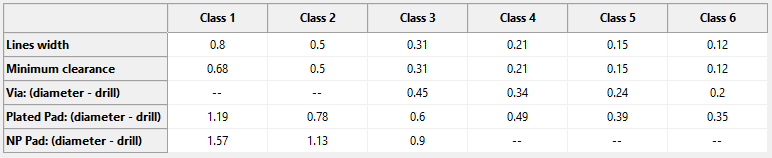
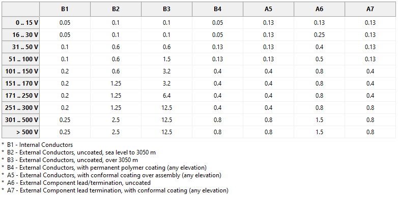

# COPPER FILLER

## Description

This plugin for automatically filling empty areas of a printed circuit board with non-conductive copper elements. Main goals:

*   **Production Cost Savings:** Reduces the consumption of etching solutions, lowering the cost of boards in large production runs.
*   **Structural Stability:** Maintains uniform board thickness on inner layers in areas without conductors and polygons, which is critical for multilayer board constructions.

## Installation

### Via KiCad Plugin and Content Manager:
1.  Open KiCad.
2.  Go to: **Tools → Plugin and Content Manager**.
3.  Search for "Copper Filler".
4.  Click the **"Install"** button.

### Backend installation for Linux
Copper Filler plugin requires several additional Python libraries:
- shapely>=2.1.2
- psutil>=7.2.0

To install the libraries, open the Terminal and enter the command:

`sudo apt install -y python3-shapely python3-psutil`

### Backend installation for Windows
The libraries are installed automatically in the KiCAD Python virtual environment. 

## System Requirements

The plugin has been tested on the following configurations:

### **Operating Systems:**
*   Windows 10 x64 Pro (21H2, 22H2)
*   Windows 11 Pro (24H2)
*   Debian 13
*   Kubuntu 24

### **Hardware Platforms:**
*   **High-End:** Intel Xeon Gold 5317, 256 GB RAM, NVIDIA RTX A2000 6GB
*   **Mid-Range:** AMD Ryzen 7 9800X3D, 64 GB RAM, NVIDIA RTX 5070 Ti 16GB; Intel Core i7-10700K, 64 GB RAM, AMD RX 580 8GB; Intel Core i5-4670, 24 GB RAM, NVIDIA GTX 1050 Ti 4GB; Intel Core i5-1340P, 16 GB RAM, Intel Iris Xe Graphics
*   **Low-Power:** Intel Celeron J4125, 16 GB RAM, Intel UHD Graphics 600

### **Software:**
*   **KiCad Version:** 9.0.5 through 9.0.7

## Usage

1.  **Select Board Class:** In the plugin settings, specify the board class. This parameter sets the **technological constraints** (minimum clearances, element sizes) according to manufacturer capabilities (see image below).

    
2.  **Important Warning:** The selected board class defines only the manufacturing (technological) minimums. It does **NOT guarantee** compliance with electrical insulation requirements for your specific circuits and clearances between conductive elements.
3.  **Configure Electrical Parameters:** The required values for trace widths and clearances (between traces, and between traces and polygons) must be assigned individually for each **Net Class** according to the insulation class table and the clearance constraints established in the PCB design rules (see image below).

    
4.  **Assign Classes to Nets:** Assign the appropriate net class to each circuit on the board according to its electrical requirements (voltage, insulation requirements, etc.).

## License

This software is distributed under the following terms:

### Permitted:
*   Free copying, distribution, and use of the source code for **personal purposes**.
*   Modification of the source code for **personal use**.

### Prohibited (until the project's official release):
*   Distribution of modified versions of the code for **any purposes** (including personal, commercial, or educational).
*   Publication of forks, derivative works, or modified versions of the plugin.

After the official release version is published, the project will be transitioned to the **MIT License**, granting full rights to use, modify, and distribute the code.
